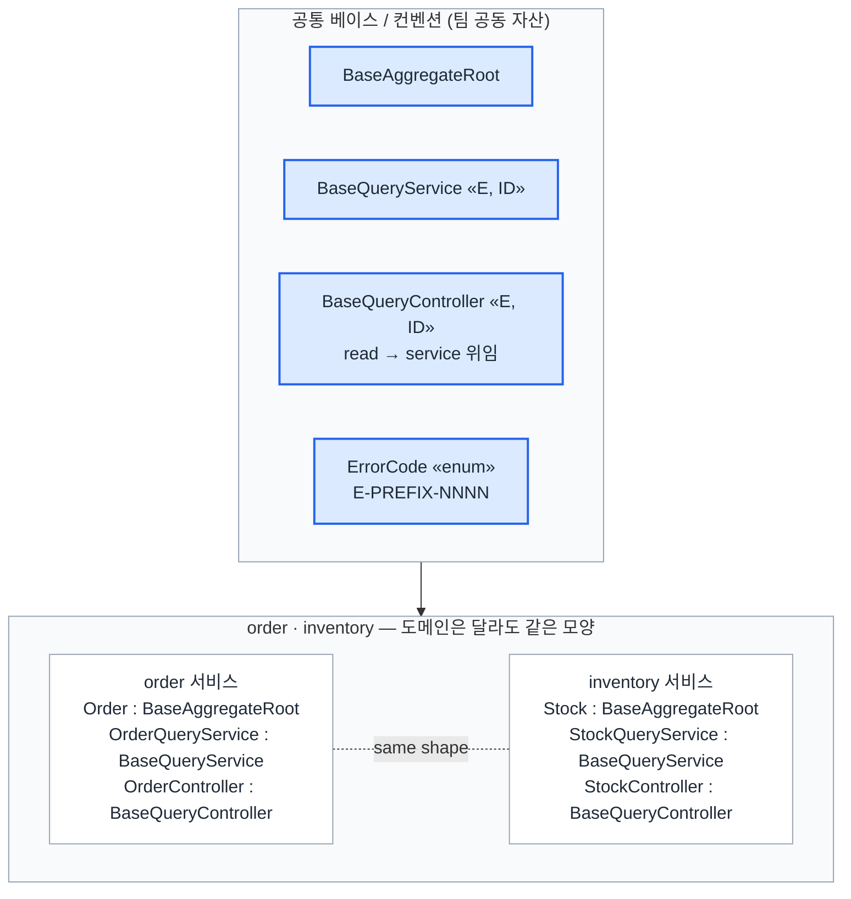
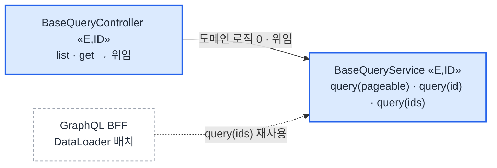

# MSA 공통 기반 레이어

> 10여 서비스·100여 도메인으로 커질 MSA를 BE 2~3인이 **한 모양으로** 운영하도록 초기에 고정한 공통 베이스. 인원이 아니라 구조로 복잡도 흡수. 팀 공동 설계 · 정착·운영 담당.

## ① 맥락 / 문제

**진짜 비용은 도메인 수가 아니라 그 구성을 일관되게 유지하는 관리 코스트 — 쌓이기 전에 구조로 막는다.**

* **환경** — 도메인이 늘 때마다 마이크로서비스와 애그리거트(Aggregate, 트랜잭션 일관성 경계)가 함께 늘어나는 시스템. 애그리거트·조회·예외·에러코드 체계를 서비스마다 따로 정하면, 운영자는 서비스마다 다른 구조를 새로 익혀야 함.
* **반복 비용** — 그 비용은 서비스 수에 비례해 누적. 새 서비스를 켤 때마다 같은 레이어를 새로 설계·학습하게 되고, 2~3인 규모에선 곧 병목.
* **접근** — 문제가 쌓인 뒤 고치는 대신 초기에 고정. 공통 레이어를 베이스 + 컨벤션으로 먼저 정해, 서비스가 늘어도 운영자가 읽는 구조는 한 장으로 유지. 실제로 10여 서비스·100여 애그리거트 규모까지 이 구조로 운영.

## ② 설계 / 구현

**핵심 설계 결정 둘:**

* **모양 강제** — 애그리거트·조회·예외·에러코드를 공통 베이스로 고정, 서비스는 상속만. 클래스 독창성이 아니라 모든 서비스가 같은 모양을 갖는 동형성이 목표.
* **컨벤션 연장** — 한 컨벤션을 write에서 멈추지 않고 read·presentation(조회→노출→집계)까지 같은 모양으로 끌고 감.

### ②-1 공통 베이스 — 한 모양으로 묶는 전체 뷰

**공통 베이스가 어떤 자산을 한 모양으로 묶고, 서비스가 무엇을 주입하는지 — 전체 그림.**

* **갈림길** — 서비스별 자유(각자 최적 구조)면 도메인엔 맞지만 서비스 수만큼 서로 다른 구조가 생김 / 공통 베이스 강제면 동형이지만 특수성을 흡수할 길이 필요.
* **선택** — 변경 잦은 **도메인 특수성만 주입으로 열고**, 조회·에러·이벤트 발행의 '모양'은 **베이스로 고정**. 2~3인 규모엔 동형성이 자유보다 싸다.



order·inventory는 100여 애그리거트 중 구조를 보여주는 대표 2종 발췌. 도메인이 달라도 조회·에러코드의 모양이 같고, 새 서비스는 베이스 상속 + prefix 하나로 같은 모양을 갖는다.

에러 응답은 write·read가 함께 쓰는 횡단 자산 — `ErrorCode` enum 한 벌이 `E-{PREFIX}-{NNNN}` 네임스페이스(ORD·INV)로 서비스 간 충돌 없이 식별하고, HTTP status를 동봉하며, 코드값은 전역 유일.

이 베이스가 강제하는 컨벤션은 write에서 멈추지 않고 read까지 같은 모양으로 연장된다 — 아래 **write 경로**와 **read 경로** 둘로 나눠 본다.

### ②-2 write 경로 — 이벤트 발행 컨벤션

* **역할** — 이벤트는 서비스 경계를 넘는 유일한 출력이고, 한번 나가면 회수할 수 없다. 잘못 발행되면(대표적으로 커밋 전 발행 → 롤백 누출) 장애가 발행한 서비스가 아니라 **소비한 서비스에서** 나타나 추적이 경계를 넘는다. 100여 애그리거트가 발행 코드를 각자 짜면 시간 문제로 밟는 함정이라, 발행 시점(커밋 후)과 주체(프레임워크)를 베이스에 박아 서비스 코드에서 실수할 자리 자체를 제거.
* **특징**
  * **수집만 — save 시 자동 발행** — `BaseAggregateRoot` 상속만으로 도메인 메서드는 `registerEvent`로 사실만 등록, 발행은 `repository.save()` 시점에 Spring Data가 수행. 서비스 코드에 발행 호출이 존재하지 않음.
  * **커밋 후 포워딩** — `DomainEventForwarder`의 `@TransactionalEventListener(AFTER_COMMIT)`가 커밋 성공 후에만 `BrokerPublisher` 포트로 넘김. 롤백된 변경의 이벤트가 밖으로 새지 않음.
  * **교체점** — 브로커는 `BrokerPublisher` 포트 뒤에서 교체. 새 서비스가 write에서 할 일은 베이스 상속뿐.

두 컨벤션 모두 Spring 기능의 채택이고, 채택의 득실은 ③ — 전체 코드는 [`snippets/`](./snippets).

```mermaid
flowchart LR
    AGG["BaseAggregateRoot<br/>registerEvent — 수집만"]
    REPO["Repository.save()<br/>Spring Data"]
    APP(["ApplicationEvent<br/>Spring"])
    FWD["DomainEventForwarder<br/>@TransactionalEventListener(AFTER_COMMIT)"]
    BRK["BrokerPublisher «port»"]
    AGG -- save --> REPO
    REPO -- "@DomainEvents 자동 발행" --> APP
    APP -- "커밋 후" --> FWD
    FWD --> BRK
    classDef core fill:#dbeafe,stroke:#2563eb,stroke-width:2px,color:#1f2937;
    classDef ext fill:#ffffff,stroke:#9ca3af,stroke-dasharray:4 3,color:#1f2937;
    class AGG,FWD core;
    class REPO,APP,BRK ext;
```



### ②-3 read 경로 — 조회·노출 표준, BFF까지

* **역할** — 같은 베이스가 read 경로(내부 조회 → REST 노출)를 한 모양으로 묶음. 노출 모양이 전 서비스에서 같아지면서, 그 위 BFF 집계 레이어까지 같은 컨벤션으로 통합되는 지점.
* **특징**
  * **표준 조회** — `BaseQueryService<E, ID>`가 조회 시그니처(`query(pageable)`·`query(id)`·`query(ids)`)를 서비스 불변으로 고정. 단건이 없으면 `ErrorCode`로 매핑.
  * **표준 노출 → BFF 통합** — `BaseQueryController<E, ID>`가 같은 모양의 read 엔드포인트를 얹음(도메인 로직 없이 `list`·`get`을 service에 위임). 모든 서비스의 노출이 같은 모양이라, 여러 서비스를 API 하나로 모으는 GraphQL BFF도 서비스마다 어댑터를 짜지 않고 이 표준 위에 바로 올라감. 여러 서비스를 묶을 때 생기는 반복 조회(N+1)까지 베이스가 물려준 배치 조회 `query(ids)`를 DataLoader에 연결하는 것만으로 배치 한 번에 해결 — 집계 레이어가 별도 설계가 아니라 표준 노출의 연장이 됨.
  * **교체점** — 새 서비스는 `BaseQueryService`·`BaseQueryController` 상속만 — BFF 스키마에도 그대로 편입.

핵심 시그니처:

```kotlin
abstract class BaseQueryService<E, ID> { suspend fun query(pageable): Page<E>; query(id): E; query(ids): List<E> }
abstract class BaseQueryController<E, ID>(service) { suspend fun list(pageable) = service.query(pageable); get(id) = service.query(id) }
```



## ③ 핵심 설계 결정

* **서비스별 최적화 대신 공통 베이스 강제.** 각 서비스가 자기 도메인에 가장 맞는 구조를 갖는 길을 포기하고, 조회·예외·이벤트 발행의 모양을 베이스로 고정했다. 특수성은 주입으로만 연다. 도메인마다 미세하게 아쉬운 지점이 남지만, 2~3인이 10여 서비스를 굴리는 규모에선 어디를 열어도 같은 구조가 보이는 쪽의 값이 더 크다고 판단.
* **이벤트 발행은 자체 구현 대신 Spring 표준 기능 채택.** 수집·자동 발행과 커밋 후 포워딩은 발명이 아니라 Spring Data(`AbstractAggregateRoot`)와 Spring 이벤트(`@TransactionalEventListener`)가 이미 제공하는 기능이다 — 결정은 그 기능을 전 서비스의 발행 컨벤션으로 고정해, 발행 시점·주체가 서비스마다 달라질 여지를 없앤 것. 대신 커밋 성공 후 브로커 발행이 실패하면 그 이벤트는 유실될 수 있다(재발행 장치 없음). 유실이 허용되지 않는 경로가 생기면 발행 보장 장치를 따로 올리는 것을 전제로 감수한 한계.
* **도메인↔영속성 격리는 의도적으로 미적용.** 결합은 코드에 그대로 드러난다 — 애그리거트 베이스가 Spring Data `AbstractAggregateRoot`를 직접 상속하고, 감사 필드(`createdAt`·`updatedAt`, 실무에선 `@CreatedDate` 류로 자동 주입)를 도메인 객체가 직접 보유하며, 조회 표준도 `Page`·`Pageable` 타입을 시그니처에 그대로 노출한다. 그 대가로 매핑 레이어 없이 2~3인이 도메인 로직에 바로 집중하고, 이벤트 자동 발행도 프레임워크에서 그대로 얻는다. 대신 도메인이 Spring Data에 묶여 영속성 컨텍스트 없이는 단위 테스트·재사용이 어렵다. `Auditable` 포트와 도메인 전용 조회 타입으로 분리하면 해소되지만, 지금 규모에선 우선순위 밖이라 인지하고 떠안은 한계.

## ④ 성과 — 서비스가 늘어도 한 장

* **운영자가 익힐 구조가 서비스 수와 무관하게 한 벌.** 조회 API의 모양은 서비스가 둘이든 열이든 하나 — 한 서비스를 읽을 줄 알면 나머지도 읽힌다.
* **그래서 온보딩·유지보수 비용이 서비스 수에 비례하지 않음.** 새 서비스를 켤 때 새로 설계·학습할 레이어가 없다 — 절감률 같은 수치는 아니어도 셀 수 있는 효과.
* **새 서비스 부트스트랩은 베이스 3종 상속 + prefix 하나.** `class Stock : BaseAggregateRoot<Stock>()` + `StockQueryService : BaseQueryService<Stock, StockId>()` + `StockController : BaseQueryController<Stock, StockId>(svc)` + `E-INV-*` — 이것만으로 조회 3종·read 표준 노출·에러 포맷·이벤트 수집이 컨벤션으로 동봉.

## 코드

* **구성**: `BaseAggregateRoot` · `BaseQueryService` · `BaseQueryController` · `ErrorCode` · `DomainEventForwarder` + `order/` · `inventory/` — [`snippets/`](./snippets)
* **환경**: Kotlin · Spring Data(`AbstractAggregateRoot`) · Spring 이벤트(`@TransactionalEventListener`) 기반, 빌드 대상 아님.
