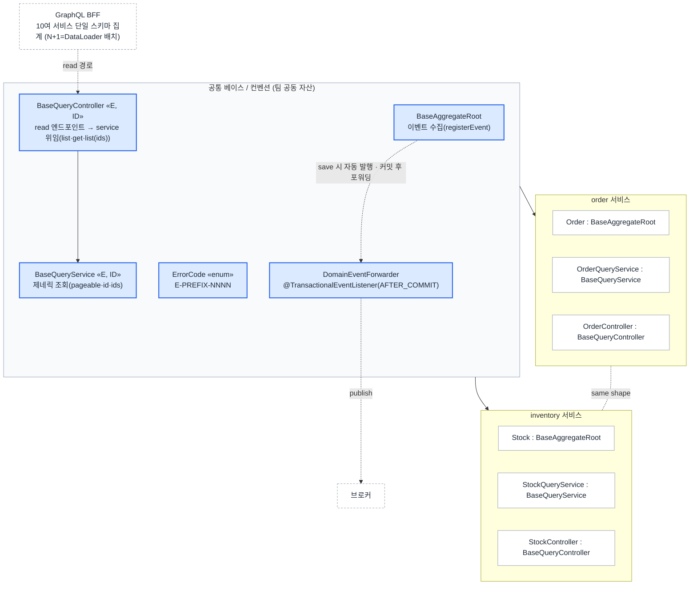

# 코드맵 — 공통 베이스 위 두 서비스 (같은 모양)

공통 베이스(Aggregate·Query·Controller·ErrorCode) 한 벌 위에 도메인이 다른 두 서비스가
*같은 모양*으로 올라간다. 서비스가 2개든 10여 개든 운영자가 읽는 구조는 한 장이다.

> 베이스는 Aggregate·Query·**Controller**·ErrorCode를 덮고, write 경로의 **이벤트 발행**까지 표준으로 고정한다 — read는 `GraphQL BFF → BaseQueryController → BaseQueryService`, 이벤트는 `registerEvent → repository.save() 자동 발행 → @TransactionalEventListener(AFTER_COMMIT) 포워딩`.
> 새 서비스 = 베이스 상속 + prefix만. 이벤트는 애그리거트가 수집만 하고, 발행은 프레임워크가 맡는다.
